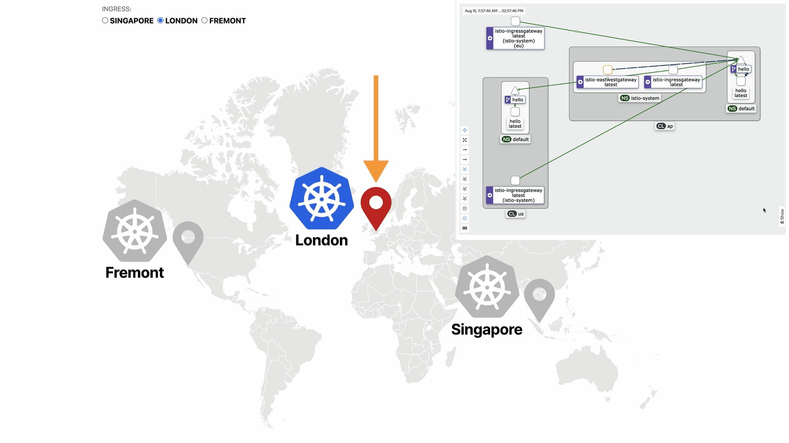

# Multi-cluster, multi-region, multi-cloud Kubernetes

This project helps you bootstrap and orchestrate several Kubernetes clusters across different regions and clouds from a single control plane.



The setup helps study:

- High availability installation of Kubernetes.
- Multi-region deployments.
- Multi-cloud deployments.
- Upgrading clusters and apps.

## Getting started

You need to create a Linode token to access the API:

```
linode-cli profile token-create
export LINODE_TOKEN=<insert the token here>
```

```
# Create the clusters
terraform -chdir=01-clusters init
terraform -chdir=01-clusters apply -auto-approve

# Install Karmada in the cluster manager
terraform -chdir=02-karmada init
terraform -chdir=02-karmada apply -auto-approve

# Configure the Karmada workers and install Istio
terraform -chdir=03-workers init
terraform -chdir=03-workers apply -auto-approve

# Discover other Istio installations
terraform -chdir=04-discovery init
terraform -chdir=04-discovery apply -auto-approve

# Install Kiali
terraform -chdir=05-dashboards init
terraform -chdir=05-dashboards apply -auto-approve

# Clean up (once done and you want to destroy the clusters)
terraform -chdir=05-dashboards destroy -auto-approve
terraform -chdir=04-discovery destroy -auto-approve
terraform -chdir=03-workers destroy -auto-approve
terraform -chdir=02-karmada destroy -auto-approve
terraform -chdir=01-clusters destroy -auto-approve
```
## Deploying a test Service

A sample nginx deployment and load balancer service yaml are included. To deploy, apply the yml via kubectl:
```
kubectl apply -f hw.yml --kubeconfig=karmada-config
```
NOTE: There seems to be a problem with Karmada propagating the ConfigMap needed for the ngnix pod. This must be deployed to every cluster for now. To do so, type this command for each cluster (change the kubeconfig value for each).
```
kubectl apply -f cm.yml --kubeconfig=kubeconfig-us
```
You will also need to deploy a Karmada policy file to set load balancing and cluster deployment rules for the nginx deployment. To apply the sample file, use kubectl:
```
kubectl apply -f policy.yml --kubeconfig=karmada-config
```
Once the deployment and application are applied, the included get-gtm.sh script can extract load balancer IPs to a gtm_hostnames CSV. To run the script, use:
```
./get-gtm.sh
```
## Accessing the Kiali dashboard

```
kubectl --kubeconfig=kubeconfig-us port-forward svc/kiali 8081:20001 -n istio-system
```

## Testing the code

```
./test.sh
```

The script will print the command you can use to launch the world map dashboard.

## Creating new certs

```
$ git clone https://github.com/istio/istio
```

Create a `certs` folder and change to that directory:

```
$ mkdir certs
$ cd certs
```

Create the root certificate with:

```
$ make -f ../istio/tools/certs/Makefile.selfsigned.mk root-ca
```

The command generated the following files:

- `root-cert.pem`: the generated root certificate.
- `root-key.pem`: the generated root key.
- `root-ca.conf`: the configuration for OpenSSL to generate the root certificate.
- `root-cert.csr`: the generated CSR for the root certificate.

For each cluster, generate an intermediate certificate and key for the Istio Certificate Authority:

```
$ make -f ../istio/tools/certs/Makefile.selfsigned.mk cluster1-cacerts
$ make -f ../istio/tools/certs/Makefile.selfsigned.mk cluster2-cacerts
$ make -f ../istio/tools/certs/Makefile.selfsigned.mk cluster3-cacerts
```

## Notes

- Sometimes, the EastWest gateway cannot be created because of a validation admission webhook. Since this is sporadic, I think it's related to a race condition. [More on this here.](https://github.com/istio/istio/issues/39205)
- This Terraform files use the `null_resource` and `kubectl`. You should have `kubectl` installed locally.
